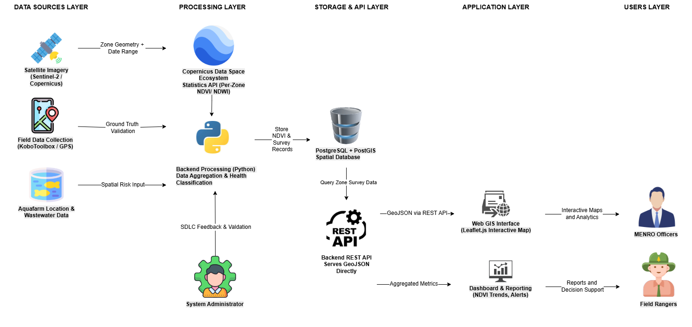
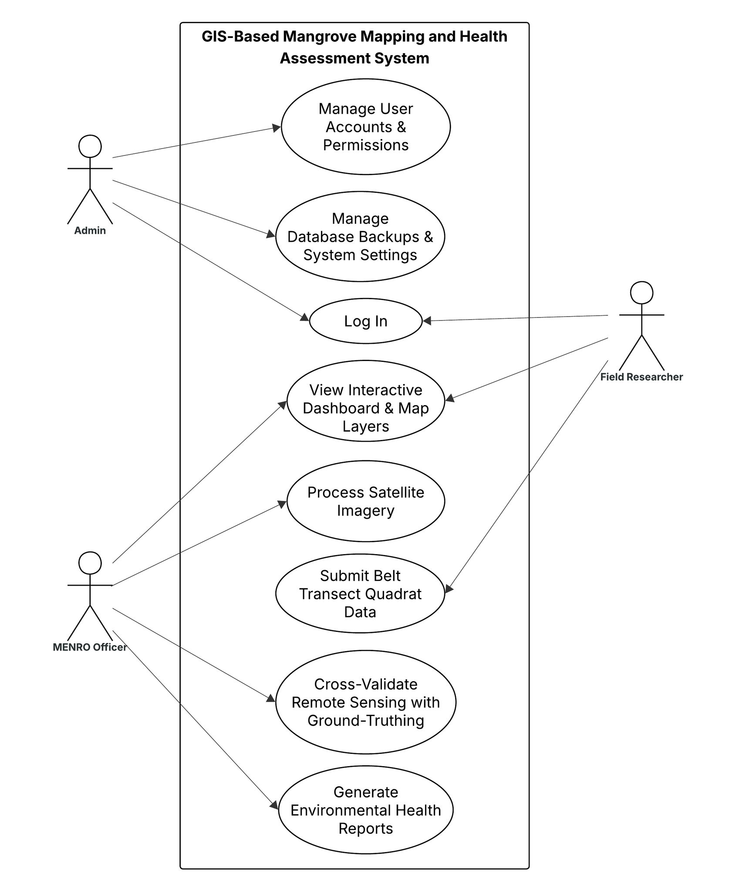

# Mapping System and Health Assessment for Mangrove Monitoring in Calatagan, Batangas
## Group Members

| Team Member | Roles |
|-------------|-----------------|
| **Daniel J. Magarao** | Software Engineer |
| **Kaye M. Macalalad** | System Analyst |
| **Rome Dyanne S. Salvid** | System Tester |

---

## 1. Overview

- **Purpose:** Give MENRO officers a single dashboard to track mangrove health across Calatagan's barangay zones, cross-referencing satellite data with ranger field surveys.
- **Scope:** Role-based login, interactive zone map, satellite NDVI sync, KoboToolbox survey integration, analytics dashboard, PDF report export.
- **Description:** A web-based GIS dashboard that combines satellite NDVI (Copernicus Sentinel-2), field survey data (KoboToolbox), and a mangrove zone registry into one system for MENRO-Calatagan.

## 2. Architecture

The system is organized into five layers:

- **Data Sources Layer** — Satellite Imagery (Sentinel-2/Copernicus), Field Data Collection (KoboToolbox/GPS), and Aquafarm Location & Wastewater Data.
- **Processing Layer** — The Copernicus Data Space Ecosystem Statistics API computes per-zone NDVI/NDWI; a Python backend handles data aggregation and health classification, guided by System Administrator feedback and validation as part of the iterative SDLC.
- **Storage & API Layer** — A PostgreSQL + PostGIS spatial database stores NDVI and survey records; a Backend REST API serves GeoJSON directly to the frontend.
- **Application Layer** — A Web GIS Interface (Leaflet.js interactive map) and a Dashboard & Reporting module (NDVI trends, alerts).
- **Users Layer** — MENRO Officers (interactive maps and analytics) and Field Rangers (reports and decision support).

**Stack:** Leaflet.js (interactive map) · Python (backend processing) · PostgreSQL + PostGIS (spatial database) · REST API (GeoJSON) · Copernicus Data Space Ecosystem Statistics API (NDVI/NDWI) · KoboToolbox (field data collection).

## 3. Use Cases

**System: GIS-Based Mangrove Mapping and Health Assessment System**

| Use Case | Actor(s) | Description |
|---|---|---|
| Log In | Admin, Field Researcher | Authenticate into the system |
| Manage User Accounts & Permissions | Admin | Create/edit user roles and access rights |
| Manage Database Backups & System Settings | Admin | Maintain system configuration and data backups |
| View Interactive Dashboard & Map Layers | MENRO Officer, Field Researcher | View zone map, NDVI/health layers, and analytics dashboard |
| Process Satellite Imagery | MENRO Officer | Trigger/review Sentinel-2 NDVI/NDWI processing per zone |
| Submit Belt Transect Quadrat Data | Field Researcher | Upload ground-truth field survey data (belt transect/quadrat method) |
| Cross-Validate Remote Sensing with Ground-Truthing | MENRO Officer | Compare satellite NDVI against field survey data to confirm zone health |
| Generate Environmental Health Reports | MENRO Officer | Produce environmental health reports for MENRO |

**Actors:**
- **Admin** — manages accounts, permissions, and system/database settings
- **MENRO Officer** — views dashboard, processes satellite imagery, cross-validates data, generates reports
- **Field Researcher** — logs in, views dashboard, submits belt transect quadrat field data

## 4. Features & Requirements

### 4.1 Authentication & Roles
- Role selector (MENRO Officer / Forest Ranger), username/password validation
- MENRO login → map dashboard; Ranger login → placeholder (planned)
- Remember-me, password visibility toggle, sign-out

### 4.2 Map, Layers & Zone List
- Interactive Leaflet map with zone markers color-coded by health status
- Layer toggles: NDVI overlay, Sentinel-2 imagery, zone boundaries
- Search by name, filter by status, sort by name/NDVI/area
- Zone popup: area, partner org, NDVI, status, survey summary

### 4.3 Satellite NDVI Sync
- Scene date + cloud-coverage threshold picker (calendar/slider)
- "Sync Satellite NDVI" computes mean NDVI per zone (Sentinel-2 bands, 10-day window)
- Satellite NDVI shown alongside field-survey NDVI, not replacing it

### 4.4 Field Survey Integration (KoboToolbox)
- Auto-retrieves and merges submissions into matching zones
- Derives zone health status from survey data when satellite NDVI is absent
- Retains ranger name, date, canopy cover, species, threats, notes per zone

### 4.5 Dashboard & Reporting
- Zone counts, health breakdown, NDVI trend, threat/canopy breakdowns
- Survey activity log + calendar widget
- PDF export: scene summary, zone table, per-zone survey detail
- In-app guided walkthrough

## 5. Interface Requirements

- **UI:** login screen, map dashboard (top bar, layers control, side panel), analytics dashboard, guide/survey-detail modals
- **Hardware:** standard desktop/tablet/browser (officers); GPS-enabled mobile device (rangers, via KoboToolbox)
- **Software:** Leaflet.js, jsPDF, CDSE/Sentinel Hub APIs (OAuth2, WMS, Statistics, Catalog), KoboToolbox REST API v2
- **Communication:** HTTPS everywhere; proxies set CORS headers and return clear error codes on failure

## 6. Non-Functional Requirements

- **Performance:** map/zone list interactive within ~3s; visible progress during NDVI sync
- **Security:** move hard-coded CDSE/KoboToolbox credentials and the token cache out of source files before production; replace demo/localStorage login with a real auth backend; restrict CORS to the deployed origin
- **Reliability:** clear proxy error codes; Online/Offline indicator; last-good data stays visible on sync failure
- **Usability:** status shown via color + text; key actions within two clicks; in-app guide
- **Maintainability:** logic split by concern (auth/map/dashboard/export); CSS design tokens
- **Scalability:** review sequential NDVI sync as zone count grows; respect API rate limits
- **Data:** NDVI to ≥2 decimals; survey field names kept in sync with the KoboToolbox form schema

## 7. Other Requirements

- **Compliance:** PDF reports attributed to MENRO-Calatagan; ranger personal data handled per the Data Privacy Act (R.A. 10173); Copernicus data attribution on publication
- **Assumptions:** active CDSE/KoboToolbox accounts; rangers have periodic (not continuous) connectivity; zone set is relatively stable
- **Future work:** Ranger landing page, real auth backend + zone database, credentials moved to environment variables, scheduled/automatic NDVI sync
